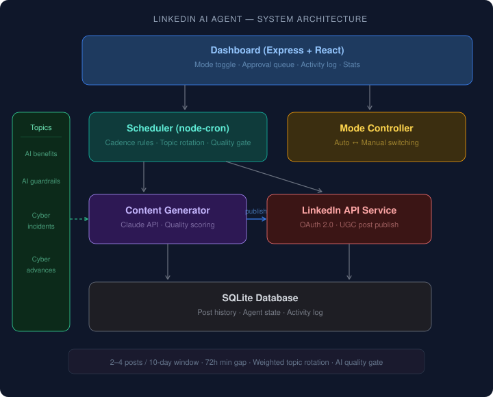

# LinkedIn AI Content Agent

An autonomous AI agent that generates and publishes LinkedIn content on four constrained topics, with configurable posting cadence and a manual approval mode.

## Topics

| Topic | Focus |
|-------|-------|
| **AI Benefits** | Real, actionable ideas for getting value from AI systems |
| **AI Guardrails** | High-level tactics for responsible AI deployment |
| **Cyber Incidents** | Analysis of recent breaches and attacks |
| **Cyber Advances** | Emerging cybersecurity technologies and tools |

## Posting Rules

- **Minimum 2 posts per week** (scheduler checks twice daily)
- **Maximum 4 posts in any rolling 10-day window**
- Minimum 72 hours between consecutive posts (configurable)
- Weighted topic rotation to ensure balanced coverage
- AI quality scoring with auto-retry for low-quality drafts

## Architecture

<p align="center">
  
</p>

The agent is composed of five core services wired through a shared SQLite database:

- **Dashboard** — Express server hosting a React control panel at `localhost:3001`. Toggle between auto/manual mode, approve or reject queued posts, and monitor activity in real time.
- **Scheduler** — A `node-cron` job that checks twice daily whether cadence rules allow a new post (72h minimum gap, 4-post rolling 10-day ceiling). When allowed, it triggers content generation.
- **Content Generator** — Calls Claude Sonnet via the Anthropic API with topic-specific system prompts and content angle rotation. Each draft goes through an automated quality check; low-scoring posts are regenerated once.
- **LinkedIn API Service** — Handles the full OAuth 2.0 flow and publishes posts via the LinkedIn UGC API. Token validation runs on each dashboard load.
- **Topic Registry** — Four constrained topic areas with weighted rotation to ensure balanced coverage and avoid consecutive repeats.

## Quick Start

### 1. Prerequisites

- **Node.js 18+**
- **Anthropic API key** — get one at https://console.anthropic.com
- **LinkedIn Developer App** — create at https://www.linkedin.com/developers/apps

### 2. Install

```bash
cd linkedin-agent
npm install
cp .env.example .env
```

### 3. Configure LinkedIn App

1. Go to https://www.linkedin.com/developers/apps
2. Create a new app (or use existing)
3. Under **Products**, request access to:
   - "Share on LinkedIn"
   - "Sign In with LinkedIn using OpenID Connect"
4. Under **Auth**, add redirect URL: `http://localhost:3001/auth/linkedin/callback`
5. Copy your Client ID and Client Secret to `.env`

### 4. Set API Keys in `.env`

```env
ANTHROPIC_API_KEY=sk-ant-your-key-here
LINKEDIN_CLIENT_ID=your_client_id
LINKEDIN_CLIENT_SECRET=your_client_secret
AGENT_MODE=manual    # Start in manual mode to review posts first
```

### 5. Start the Agent

```bash
npm run dev
```

### 6. Connect LinkedIn

Open `http://localhost:3001` and click the LinkedIn connect link, or run:

```bash
npm run auth
```

Complete the OAuth flow in your browser. The callback page will display your access token and person URN — add both to your `.env` file.

### 7. Test Content Generation

```bash
npm run test-post
```

This generates a post and shows the quality assessment without publishing anything.

## Usage

### Dashboard (`http://localhost:3001`)

The dashboard provides:

- **Mode Toggle** — Switch between AUTO (fully autonomous) and MANUAL (approve each post)
- **Stats** — Total posts, 10-day cadence meter, pending approvals
- **Approval Queue** — In manual mode, review, approve, or reject each generated post
- **Post History** — Click any post to see full content and quality scores
- **Preview** — Generate a test post without saving it
- **Activity Log** — Real-time feed of agent actions

### Modes

| Mode | Behavior |
|------|----------|
| **Manual** | Agent generates content on schedule, queues it for your approval. You click Approve or Reject. |
| **Auto** | Agent generates and publishes content autonomously within cadence rules. |

### Cadence Configuration (`.env`)

```env
MIN_HOURS_BETWEEN_POSTS=72    # Minimum gap between posts
MAX_POSTS_PER_10_DAYS=4       # Hard ceiling per rolling window
PREFERRED_POST_HOUR=9         # What hour to check/generate (local time)
```

The scheduler runs checks twice daily (at the preferred hour and 12 hours later). It will only generate and post when cadence rules allow.

## API Endpoints

| Method | Endpoint | Description |
|--------|----------|-------------|
| GET | `/api/status` | Agent status, stats, cadence info |
| GET | `/api/posts` | List posts (`?status=pending_approval`) |
| GET | `/api/posts/:id` | Single post detail |
| POST | `/api/posts/:id/approve` | Approve and publish a pending post |
| POST | `/api/posts/:id/reject` | Reject a pending post |
| POST | `/api/mode` | Set mode (`{ "mode": "auto" }`) |
| POST | `/api/pause` | Pause agent (`{ "paused": true }`) |
| POST | `/api/generate-preview` | Generate a post preview (not saved) |
| POST | `/api/force-cycle` | Manually trigger a scheduler cycle |
| GET | `/api/logs` | Activity log |

## Scope Limitations (v1)

This agent **only creates original posts** to your profile. By design, it does NOT:

- Reply to or comment on other people's posts
- React to or engage with external content
- Send connection requests or messages
- Share or repost others' content

These boundaries can be expanded in future versions.

## Token Refresh

LinkedIn access tokens expire after 60 days. The agent logs a warning when the token is invalid. To refresh:

1. Run `npm run auth`
2. Complete the OAuth flow
3. Update `LINKEDIN_ACCESS_TOKEN` in `.env`
4. Restart the agent

## File Structure

```
linkedin-agent/
├── .env.example              # Environment template
├── package.json
├── public/
│   └── index.html            # Dashboard React app
├── scripts/
│   ├── linkedin-auth.js      # OAuth setup helper
│   └── test-post.js          # Test content generation
├── src/
│   ├── index.js              # Main entry point
│   ├── config/
│   │   └── topics.js         # Topic definitions & rotation
│   ├── routes/
│   │   └── api.js            # Express API routes
│   └── services/
│       ├── content-generator.js  # Anthropic Claude integration
│       ├── database.js           # SQLite persistence
│       ├── linkedin-api.js       # LinkedIn OAuth & posting
│       └── scheduler.js          # Cadence engine
└── data/
    └── agent.db              # SQLite database (auto-created)
```
